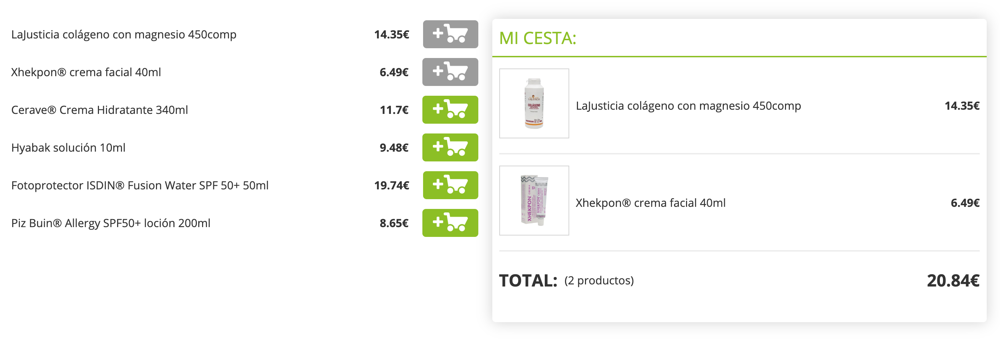

# Promofarma's frontend exercice

This repository contains my solution to the frontend exercice proposed by Promofarma.

See deployed version [here](http://closed-floor.surge.sh/)



## Instructions

Crear un una página estática como la mostrada en las capturas adjuntas, que presente un componente de listado de productos y una cesta de la compra. Al añadir productos al carrito, este actualiza el listado de productos añadidos y recalcula el total.


### Conditions

#### Listado de productos:
* Puedes mostrar los productos estáticamente, sin necesidad de acceder a ninguna API.
* Para simplificar la prueba, solo se puede añadir un producto al carrito una sola vez. Al añadirlo, el botón se deshabilita y se muestra en gris.

#### Cesta de la compra:
* Muestra los elementos añadidos, la suma del valor de los productos y el total de elementos.
* Si no hay productos, se muestra solo la subsección de 0 productos y 0 € de precio Total.
* No es necesario implementar el caso de eliminar items de la cesta.
* En mobile, la cesta se muestra como una sección fija en el inferior de la pantalla (sticky), y solo muestra el precio y total de productos.

#### Reglas:
* Debes aportar las instrucciones para iniciar la aplicación, por ejemplo en un README.md, en el caso de que sea necesario.
* Recomendamos incluir comentarios en el código para ampliar cualquier decisión de diseño.
* La maquetación debe respetar el diseño adjunto y debe ser responsive. Te adjuntamos las capturas a doble retina (desktop y mobile).
* La fuente usada es OpenSans.
* En el adjunto, te proveemos de las imágenes e iconos que puedas necesitar. 
* Puedes utilizar cualquier librería o framework que se requiera, o no usar ninguna.
* Puedes utilizar la especificación de lenguaje que prefieras (ES5, ES6, TypeScript…)
* Puedes utilizar cualquier module bundler o herramienta de automatización, si lo crees oportuno.

#### Algunos aspectos que también valoramos:
* Uso de metodologías de diseño (BEM, SMACSS o OOCSS)
* Uso de buenas prácticas para la mejora de la performance.
* Incluir el directorio .git con la revisión de los cambios


## Instalation

Install dependencies: 
```sh
npm i
```

Build dist folder: 
```sh
npm run build
```

Launch local server: 
```sh
npm run dev
```

Demo is available at http://localhost:8080/


## Testing

To launch test: 
```sh
npm test
```